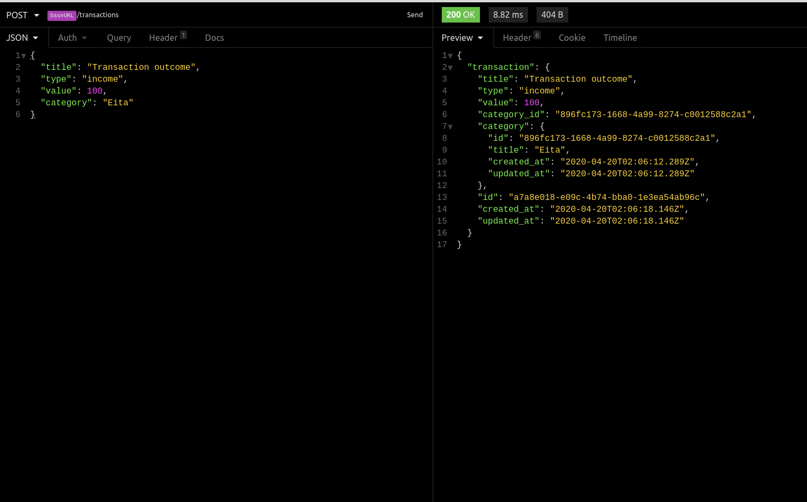
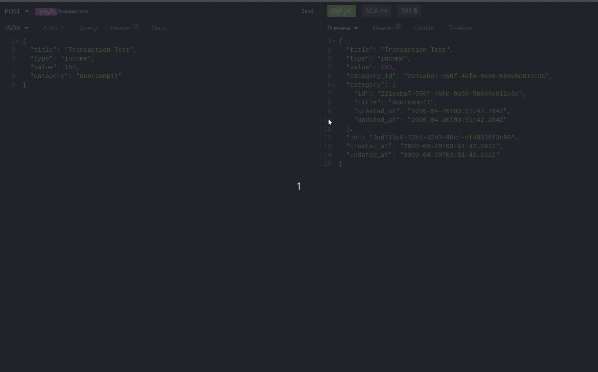
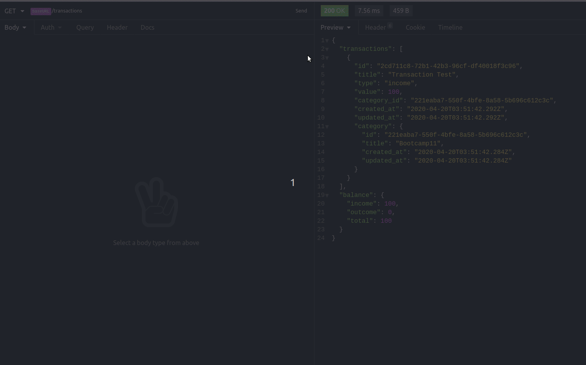
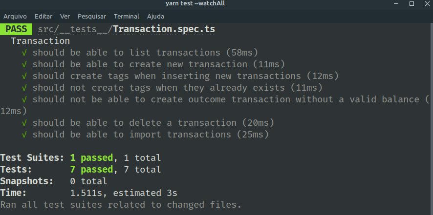

# Desafio 06 - Banco de dados e upload de arquivos no Node.js

> Projeto Aplicado pela rocketseat durante o bootcamp :rocket: Gostack 11 .

## Sobre o Desafio

Nesse desafio,  foi necessário continuar desenvolvendo a aplicação de gestão de transações, [:rocket: ** veja o desafio 05 aqui ** :rocket:](https://github.com/tnazevedo/Desafio05-PrimeiroProjetoNodejs), treinando o que foi aprendido até agora no Node.js junto ao TypeScript, mas dessa vez incluindo o uso de banco de dados com o TypeORM e envio de arquivos com o Multer!

Essa aplicação deve armazenar transações financeiras de entrada e saída e permitir o cadastro e a listagem dessas transações, além de permitir a criação de novos registros no banco de dados a partir do envio de um arquivo csv.

## :exclamation: Dependências do projeto

> :thumbsup: Dependencias de Desenvolvimento.

```json
"devDependencies": {
    "@types/express": "4.17.3",
    "@types/express-serve-static-core": "4.17.2",
    "@types/jest": "^25.2.1",
    "@types/multer": "^1.4.2",
    "@types/supertest": "^2.0.8",
    "@typescript-eslint/eslint-plugin": "^2.27.0",
    "@typescript-eslint/parser": "^2.27.0",
    "cross-env": "^7.0.2",
    "eslint": "^6.8.0",
    "eslint-config-airbnb-base": "^14.1.0",
    "eslint-config-prettier": "^6.10.1",
    "eslint-import-resolver-typescript": "^2.0.0",
    "eslint-plugin-import": "^2.20.1",
    "eslint-plugin-prettier": "^3.1.2",
    "jest": "^25.3.0",
    "prettier": "^2.0.4",
    "supertest": "^4.0.2",
    "ts-jest": "^25.3.1",
    "ts-node": "3.3.0",
    "ts-node-dev": "^1.0.0-pre.44",
    "typescript": "^3.8.3"
  }

```

 > :thumbsup: Dependencias de produção.

 ```json
 "dependencies": {
    "@types/csv-parse": "^1.2.2",
    "csv-parse": "^4.8.8",
    "dotenv": "^8.2.0",
    "express": "^4.17.1",
    "express-async-errors": "^3.1.1",
    "multer": "^1.4.2",
    "pg": "^8.0.2",
    "reflect-metadata": "^0.1.13",
    "typeorm": "^0.2.24",
    "uuid": "^7.0.3",
    "uuidv4": "^6.0.7"
  },

 ```

## :ok_hand: Exemplo de uso

- **POST /transactions**: A rota deve receber title, value, type, e category dentro do corpo da requisição, sendo o type o tipo da transação, que deve ser income para entradas (depósitos) e outcome para saídas (retiradas). Ao cadastrar uma nova transação, será armazenada dentro do banco de dados, possuindo os campos `id`, `title`, `value`, `type`, `category_id`, `created_at`, `updated_at`.



- **GET /transactions:** Essa rota deve retornar uma listagem com todas as transações que foram cadastradas, junto com o valor da soma de entradas, retiradas e total de crédito. Essa rota retorna um objeto.

> **Formato do objeto a seguir.**
 ```json
{
    {
      "id": "bda0335b-f1b6-4385-a052-a1c94af608e8",
      "title": "Transaction Test",
      "type": "outcome",
      "value": 50,
      "category_id": "221eaba7-550f-4bfe-8a58-5b696c612c3c",
      "created_at": "2020-04-20T04:08:12.967Z",
      "updated_at": "2020-04-20T04:08:12.967Z",
      "category": {
        "id": "221eaba7-550f-4bfe-8a58-5b696c612c3c",
        "title": "Bootcamp11",
        "created_at": "2020-04-20T03:51:42.284Z",
        "updated_at": "2020-04-20T03:51:42.284Z"
      }
    }
  ],
  "balance": {
    "income": 1600,
    "outcome": 103,
    "total": 1497
  }

}
```

> **Exemplo de funcionamento da Rota.**



- **Dentro de balance**, o `income` é a soma de todos os valores das transações com type income. O `outcome` é a soma de todos os valores das transações com type outcome, e o `total` é o valor de `income - outcome`.

>**Formato do Objeto Balance.**

```json
"balance": {
    "income": 1600,
    "outcome": 103,
    "total": 1497
  }
```

- **POST /transactions/import**: Essa  rota permiti a importação de um arquivo com formato `.csv` contendo as mesmas informações necessárias para criação de uma transação `id`, `title`, `value`, `type`, `category_id`, `created_at`, `updated_at`, onde cada linha do arquivo CSV é um novo registro para o banco de dados, e por fim retorna todas as transactions que foram importadas para o banco de dados.

> **Exemplo de Utilização da Rota Imports.**


- **DELETE /transactions/:id**: A rota  deleta uma transação com o `id` presente nos parâmetros da rota;


> **Exemplo de Utilização da Rota Delete**


## Configuração para Desenvolvimento

- Basta utilizar o gerenciador de pacotes para instalar todas as dependências do projeto que já estão no arquivo `package.json`.

```sh
yarn || npm
```

### Sobre a API

- A **API** utiliza  a porta `3333` para se conectar ao servidor.

```json
"http://localhost:3333",

```

- Para executar os testes utilize um dos comandos abaixo:

> :bangbang: ***Antes de testar crie uma database com o nome gostack_desafio06_tests***

```sh

npm test ou yarn test
```



## :v: :v: Meta

:v: Talita Azevedo :v: – [Github - tnazevedo](https://github.com/tnazevedo/) – talita.azevedo360@gmail.com

## :star: :star: :star: Contributing

1. Faça o _fork_ do projeto [`Clique aqui`:v:](https://github.com/tnazevedo/Desafio06-BancoDeDadosDeArquivosNodeJs/fork)
2. Crie uma _branch_ para sua modificação (`git checkout -b feature/fooBar`)
3. Faça o _commit_ (`git commit -am 'Add some fooBar'`)
4. _Push_ (`git push origin feature/fooBar`)
5. Crie um novo _Pull Request_.
